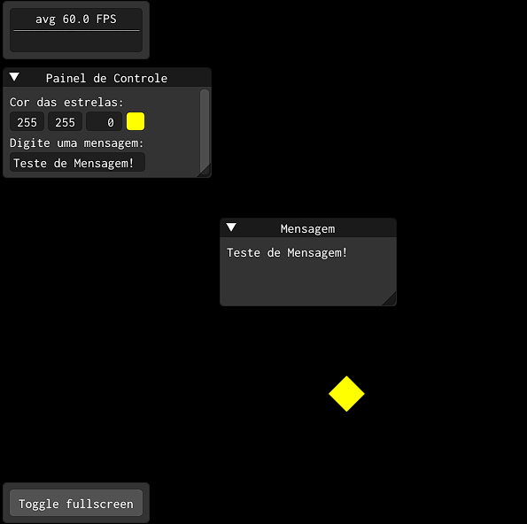
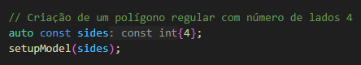
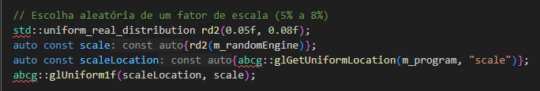
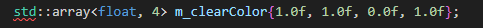
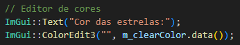
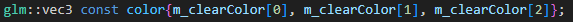
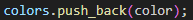
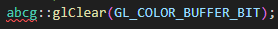

# ABCg (Atividades)

## Atividade 1

**Apresentação:** [Computação Gráfica - Atividade 01 - William Crispim - 11201722180](https://docs.google.com/presentation/d/1K6EUfeZdftWrELGmf3bpBMwtQCsK9HI7Ro8I00ZQlZ8/edit?usp=sharing)

[Aplicação interativa com gráficos 2D (17/10)](https://williamcrispim.github.io/abcg-atividades/chuvaEstrelas/)



**Integrantes:**

| Nome    | RA |
| -------- | ------- |
| William Crispim da Silva  | 11201722180    |

### Detalhes do Projeto Chuva de Estrelas

Este projeto é uma modificação do projeto [Polígonos regulares](https://hbatagelo.github.io/cg/regularpolygons.html) com o intuíto de colocar em prática alguns conceitos aprendidos durante as aulas de computação gráfica.

A idéia do projeto é simular uma chuva de estrelas em que é possível escolher a cor para as estrelas e caso necessário adicionar uma mensagem para quem está visualizando a tela, com o foco em possibilitar a interação via mouse e teclado.

Fiz questão de deixar os comentários que fiz no código para tentar de certa forma demonstrar minha linha de raciocínio em meio ao modificação do projeto mostrado em aula e o desenvolvimento dessa atividade.

O projeto é basicamente a estrutura do projeto [Polígonos regulares](https://hbatagelo.github.io/cg/regularpolygons.html) com alterações na exibição das formas geométricas e mudando a forma de iteração com a aplicação.

Inicialmente manipulei as formas geométricas para mudarem o formato, que no projeto original eram aleatórias e o objetivo era ter uma forma parecida com uma estrela. Após alguns testes, obtive êxito escolhendo formas com 4 lados.



Com as formas parecidas com uma estrela, precisei diminuir o tamanho delas, pois não estavam parecendo estrelas e então alterei o intervalo da escala das formas geométricas para um intervalo entre 5% e 8%. Ficaram mais parecidas com estrelas.



O projeto inicial as cores eram aleatórias e gradientes do centro até as extremidades das formas geométricas, para alterar as cores de acordo com a escolha do usuário precisei manipular a interface e criar um seletor de cores e vinculá-lo com a cor de cada forma geométrica que estava sendo criada. Precisei também padronizar, pois o formato original era composto por duas cores, padronizei todos para buscarem os valores de um array que seria manipulado pelo seletor de cores.

*Array com os componentes RGB (por padrão amarelo):*



*Seletor de cores utilizando o array criado anteriormente:*



*Padronizando as cores das formas geométricas:*



*Alterando as chamadas de `colors.push_back`:*



Até o então, as estrelas estavam tomando toda a tela até formar uma camada única da cor escolhida, meu intuíto é que elas ficassem por poucos segundos dando um efeito de chúvisco na tela segundo minha perspectiva. Fazendo alguns testes e pesquisando na internet alguma possível solução não tive tanto êxito, então resolvi limpar o buffer após cada estrela ser colocada em tela, chegando próximo a idéia inicial que tinha.



Com essa linha de código logo no começo da função `onPaint` consegui que cada estrela pudesse ser criada em um buffer limpo, excluindo as estrelas anteriores.

A partir dessas alterações já estava com o formato em que desejava, algo parecido com uma chuva ou chuvísco de estrelas por padrão amarelas possibilitando a troca da cor por meio do seletor de cores.

Por fim, fiz algumas alterações na interface para a criação de um campo de texto e uma caixa para a visualização do texto, ambos com suas localizações de início pré definidas e com a possibilidade de redimensionar as janelas caso necessário, nesta etapa precisei fazer uma consulta na internet e nas notas de aula para entender como deixar uma dimensão pré definida e possibilitar o ajuste da mesma, pois, um dos problemas que tive era que quando a pré-definição de tamanho da janela era configurada, eu não conseguia redimensioná-la.

*Exemplo de como fiz para configurar a localização de início da janela painel de controle:*
```cpp
ImGui::SetNextWindowPos(ImVec2(5, 80), ImGuiCond_FirstUseEver);
```

Após algumas leituras na internet e consultando alguns exemplos após o problema que mensionei, consegui fazer essa configuração simultânea usando o seguinte trecho de código para as janelas que precisassem ter o tamanho pré-definido e que pudesse ser redimensionadas:

```cpp
ImGui::SetNextWindowSizeConstraints(ImVec2(200, 125), ImVec2(FLT_MAX, FLT_MAX));
```

Onde, usando o `SetNextWindowSizeConstraints` do `ImGui`, o `ImVec2(FLT_MAX, FLT_MAX)` especifica que não tem restrições máximas para o ajuste da janela e que em conjunto com `ImVec2(200, 125)` forma o intervalo de tamanho inicial e até onde a janela pode ser redimensionada. Foi assim que consegui solucionar o problema de não conseguir redimensionar uma janela que tivesse seu tamanho configurada no início da aplicação.

Assim ficou a versão final da **atividade 01**: https://williamcrispim.github.io/abcg-atividades/chuvaEstrelas/.

